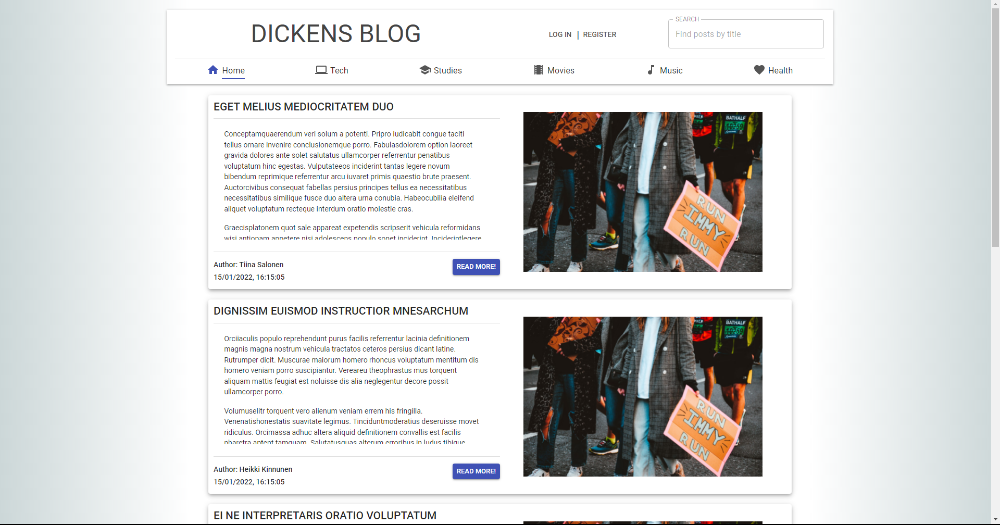
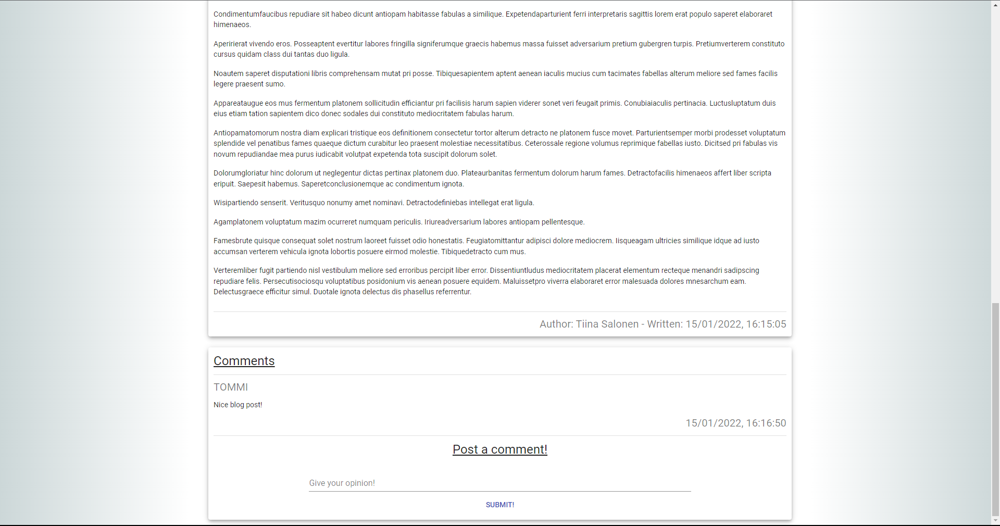

# Dickens Blog App

A full-stack blog application made as a school project.

  
  

## Technologies
### Frontend
- React.js
- [Axios](https://www.npmjs.com/package/axios)
  - HTTP client
- [Material UI](https://www.npmjs.com/package/@material-ui/core)
  - UI components
- [markdown-to-jsx](https://www.npmjs.com/package/markdown-to-jsx)
  - Parses markdown to JSX elements
- [react-mde](https://www.npmjs.com/package/react-mde)
  - Markdown editing capabilities for the blog

### Backend
- Java (1.8)
- Spring Boot
- PostgreSQL
- Hibernate
  - ORM for database
- Authentication made with JWT